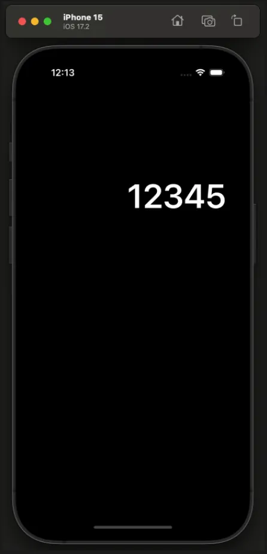
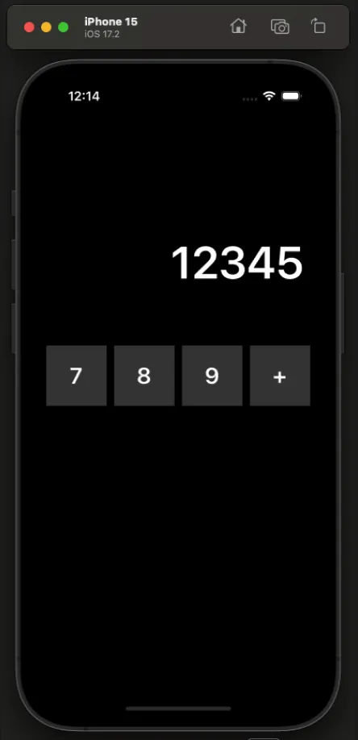
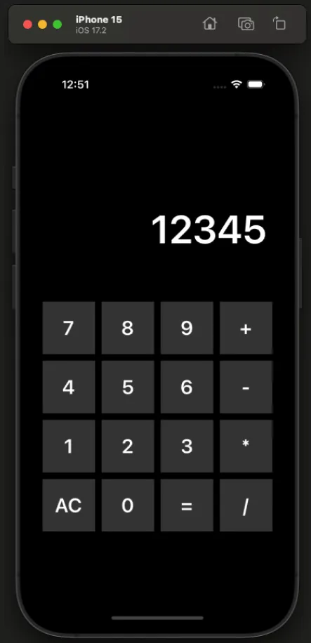
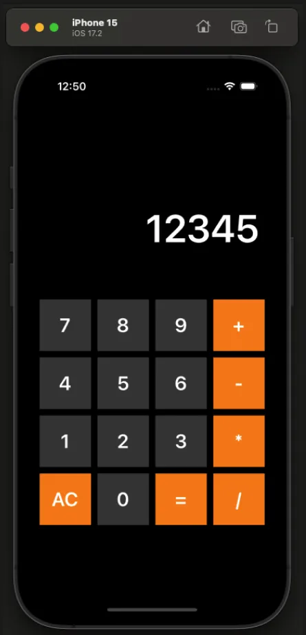
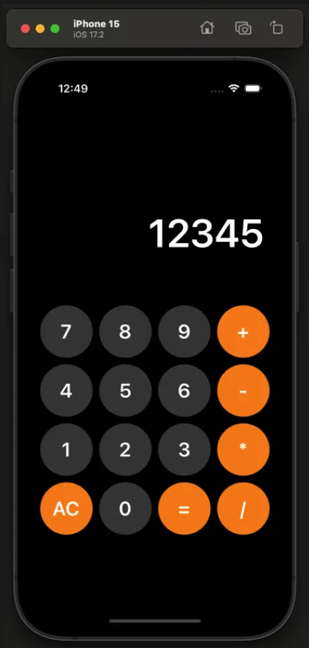
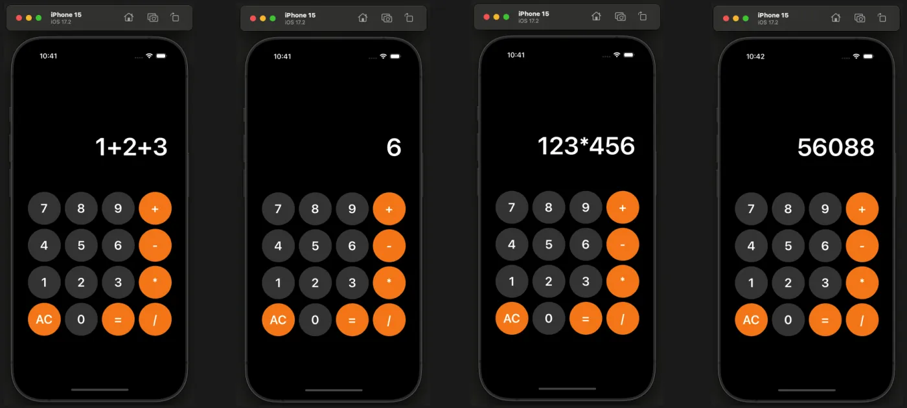

# 계산기 만들기 과제 (Week 3-4)
***

## 📚 레벨별 구현 내용
### **필수 구현**

| Lv 1 | Lv 2 | Lv 3 | Lv 4 | Lv 5 |
| :-: | :-: | :-: | :-: | :-: |
|  |  |  |  |  |
| UILabel 생성하기 | UIStackView 사용하기 | UIStackVIew 추가 생성하기 | 버튼 색상 변경 | 버튼 모양 원형으로 만들기 |

### **도전 구현**

- Lv 6
    1. 버튼을 클릭하면 라벨에 표시되도록 변경
    2. 기본 텍스트를 "12345" -> "0" 으로 변경
    3. 기본으로 라벨에 노출되어있던 텍스트 오른쪽에 버튼을 클릭하면 그 버튼의 값이 추가되도록 합니다.
        - EX)
            - 맨처음 기본값 `0` 
            - 그 다음 `1` 클릭했음 → 표시되는 값은 `01` 
            - 그 다음 `2` 클릭했음 → 표시되는 값은 `02` 
            - 그 다음 `+` 클릭했음 → 표시되는 값은 `02+` 
            - 그 다음 `3` 클릭했음 → 표시되는 값은 `02+3` 
        - 하지만 `012` 라는 값은 이상하기 때문에 맨 앞자리가 `0` 인 숫자라면, 0을 지우고 표현
        - EX) `012` → `12` 로 표현
    
- Lv 7
    1. 초기화 버튼 구현
    2. `AC` 버튼을 클릭하면 모든 값을 지우고 "0"으로 초기화
        
- Lv 8
    1. 등호(`=`) 버튼을 클릭하면 연산이 수행되도록 구현
    2. EX)
        - `1+2+3`을 입력 후 `=`을 클릭하면 결과값 `6` 출력
        - `123*456`을 입력 후 `=`을 클릭하면 결과값 `56088` 출력
    

***

## ⏰ 과제 일정
- 시작: 11월 11일 (월)
- 종료: 11월 22일 (금) PM 12:00 까지

***

## 🔥 구현 목표 🔥
- 코드를 최대한 재사용성을 살려 사용하기
- 도전구현까지 모두 완료해보기
- 예외상황에 대한 처리(Error) 진행하기
- 문서 주석을 활용한 앱 설명 구체화하기

***

## ✖️➗ 계산기 기능 ➕➖
### 1. 계산 기능
- 정수와 연산자 기호를 이용하여 계산을 할 수 있다.
- 더하기, 빼기, 곱하기, 나누기의 계산을 할 수 있다.

### 2. 오류 출력 기능
- 잘못된 입력(ex: 1++)을 감지하고 에러를 반환하는 기능

### 3. 초기화 기능
- 입력한 값을 모두 초기화 하는 기능

***

## 🤔 레벨별 고민했던 점
### Lv 1.
레벨 1에서 고민했던 점은 과제의 진행을 코드베이스로 할지, 스토리보드로 할지 정하는 것이었다.
시간이 남는다면 둘 다 진행해보겠지만, 지금 내 실력에서는 어려울 것 같다고 생각했고,
내게 조금 더 잘 맞는 방식이었던 코드베이스 방식을 선택했다.

### Lv 2.
레벨 2에서 고민했던 점은 코드의 재활용성에 대한 문제이다.
스택뷰를 사용하여 버튼을 구성하였는데, 단순히 스택뷰를 인스턴스화 하여 선언하고 내부에 버튼을 구현하면
코드가 너무 길어져서 가독성이 크게 떨어졌다.
때문에 기본적인 값을 가진 스택뷰를 클래스로 정의했고, 클래스 메소드를 통해 스택뷰 내부에 뷰 요소를 쉽게 추가할 수 있도록 하였다. 그러나 여전히 버튼에 대한 오토레이아웃이나 설정 때문에 코드의 가독성이 떨어진다고 생각되었다.
때문에 버튼의 데이터를 담는 배열을 생성하고, 버튼의 값 및 오토레이아웃을 한번에 설정할 수 있는 메소드를 구현하여 사용하였고, 덕분에 코드의 가독성을 높일 수 있었다.

여기서 고민했던 점은 메소드의 매개변수가 너무 많아지는 것은 오히려 코드의 가독성을 헤치지 않을까? 하는 점이었다.
필요한 변수를 매개변수로 지정하다보니 필요한 매개변수의 양이 많아졌고, 때문에 메소드의 선언 길이가 길어졌다. 매개변수의 길이를 줄일 수 있는 방법이 무엇이 있을까 고민해보았지만 클로저 외에는 답이 떠오르지 않았다. 그러나 클로저도 올바른 답인지는 알 수 없었다.

### Lv 3.

### Lv 4.

### Lv 5.

### Lv 6.

### Lv 7.

### Lv 8.
